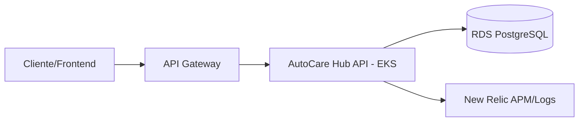

# AutoCare Hub API

Aplicacao principal backend do AutoCare Hub, responsavel por clientes, veiculos, pecas, usuarios e ordens de servico.

## Tecnologias

- Java 21
- Spring Boot
- Spring Security JWT
- Spring Data JPA
- PostgreSQL
- Flyway
- Maven
- Docker
- Kubernetes/EKS
- New Relic para APM, logs e metricas

## Execucao local

```powershell
mvn test
mvn spring-boot:run
```

## Build Docker

```powershell
docker build -t autocarehub-api:local .
```

## Deploy

A pipeline executa testes em Pull Requests e publica imagem no ECR com deploy automatico em `homolog` e `main`.

## APIs

- Swagger/OpenAPI: `docs/api/openapi/openapi.yaml`
- Postman: `docs/api/postman/autocarehub-phase2.postman_collection.json`

## Arquitetura especifica


