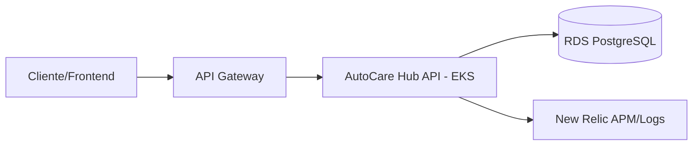

# AutoCare Hub API

Aplicacao principal backend do AutoCare Hub, responsavel por clientes, veiculos, pecas, usuarios e ordens de servico.

## Tecnologias

- Java 21
- Spring Boot
- Spring Security JWT
- Spring Data JPA
- PostgreSQL/RDS
- Flyway
- Maven
- Docker
- Kubernetes/EKS
- New Relic Java Agent, APM, logs e metricas

## Autenticacao

A API aceita dois tipos de JWT assinados com o mesmo `JWT_SECRET`:

- JWT interno emitido por `/api/v1/auth/login` para administradores e funcionarios.
- JWT externo emitido pela Lambda `SOAT-FIAP-autocare-auth-lambda` no fluxo `POST /auth/cpf`.

O token da Lambda deve conter `role=CUSTOMER` e `customerId`; a API monta um principal de cliente e aplica as regras de acesso ja existentes.

## Observabilidade

- Healthchecks: `/actuator/health`, `/actuator/health/liveness`, `/actuator/health/readiness`.
- Metricas: `/actuator/metrics` e metricas customizadas `autocare.service_orders.*`.
- Logs: JSON no stdout com `correlationId` vindo de `X-Correlation-Id` ou gerado automaticamente.
- APM: New Relic Java Agent embarcado no Dockerfile. Configure `NEW_RELIC_LICENSE_KEY` e `NEW_RELIC_APP_NAME`.

## Execucao local

```powershell
mvn test
mvn spring-boot:run
```

## Build Docker

```powershell
docker build -t autocarehub-api:local .
```

## Deploy

A pipeline executa testes em Pull Requests e publica imagem no ECR com deploy automatico em `homolog` e `main`.

Secrets esperados:

- `AWS_ACCESS_KEY_ID`
- `AWS_SECRET_ACCESS_KEY`
- `AWS_REGION`
- `ECR_REGISTRY`
- `EKS_CLUSTER_NAME`
- `NEW_RELIC_LICENSE_KEY`

## APIs

- Swagger/OpenAPI local: `docs/api/openapi/openapi.yaml`
- Swagger via API Gateway: `https://<api-gateway-id>.execute-api.<region>.amazonaws.com/openapi.yaml`
- Postman: `docs/api/postman/autocarehub-phase2.postman_collection.json`

## Arquitetura especifica


