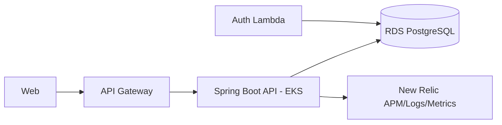

# AutoCare Hub API

Aplicacao principal backend do AutoCare Hub. Este repositorio contem a API Spring Boot responsavel por clientes, veiculos, pecas, usuarios, ordens de servico, orcamentos, estoque, seguranca e metricas de negocio.

## Papel na Arquitetura

A API roda em Kubernetes/EKS, recebe chamadas do API Gateway em `/api/*`, valida JWTs internos e JWTs emitidos pela Lambda de CPF, acessa o RDS PostgreSQL e envia telemetria para o New Relic.



## Tecnologias

- Java 21
- Spring Boot
- Spring Security JWT
- Spring Data JPA
- Flyway
- PostgreSQL/RDS
- Micrometer/Actuator
- New Relic Java Agent
- Docker
- Kubernetes/EKS
- GitHub Actions

## Autenticacao

A API aceita dois fluxos de JWT assinados com o mesmo `JWT_SECRET`:

- Interno: `POST /api/v1/auth/login`, usado por administradores e funcionarios.
- Cliente: `POST /auth/cpf`, emitido pela Lambda do repositorio `SOAT-FIAP-autocare-auth-lambda`.

Para tokens da Lambda, a API espera claims `role=CUSTOMER`, `customerId` e `document`. Quando o usuario nao existe na tabela local de usuarios, o filtro JWT cria um principal temporario de cliente e aplica as regras de autorizacao existentes.

## Observabilidade

- Healthchecks: `/actuator/health`, `/actuator/health/liveness`, `/actuator/health/readiness`.
- Metricas: `/actuator/metrics` e `autocare.service_orders.*`.
- Logs: JSON no stdout com `correlationId` vindo de `X-Correlation-Id`.
- APM: New Relic Java Agent embarcado no Dockerfile.

## Execucao Local

```powershell
mvn test
mvn spring-boot:run
```

Variaveis locais principais:

```env
DB_URL=jdbc:postgresql://localhost:5432/autocarehub
DB_USERNAME=autocarehub
DB_PASSWORD=autocarehub
JWT_SECRET=troque-por-um-segredo-com-pelo-menos-32-bytes
NEW_RELIC_LICENSE_KEY=
NEW_RELIC_APP_NAME=AutoCare Hub API
```

## Build Docker

```powershell
docker build -t autocarehub-api:local .
```

## CI/CD

A pipeline executa testes em PRs e publica imagem no ECR com deploy automatico em `homolog` e `main`.

Secrets esperados no GitHub:

- `AWS_ACCESS_KEY_ID`
- `AWS_SECRET_ACCESS_KEY`
- `AWS_REGION`
- `ECR_REGISTRY`
- `EKS_CLUSTER_NAME`
- `NEW_RELIC_LICENSE_KEY`

## Swagger/Postman

- Swagger local: `http://localhost:8080/swagger-ui/index.html`
- Swagger via API Gateway: `https://<api-gateway-id>.execute-api.<region>.amazonaws.com/api/swagger-ui/index.html`
- OpenAPI: `docs/api/openapi/openapi.yaml`
- Postman: `docs/api/postman/autocarehub-phase2.postman_collection.json`

## Documentacao Arquitetural

- Componentes cloud: `docs/architecture/cloud-components.md`
- Sequencias: `docs/architecture/sequences.md`
- RFC AWS: `docs/rfc/RFC-001-aws.md`
- RFC PostgreSQL/RDS: `docs/rfc/RFC-002-postgresql-rds.md`
- RFC CPF + JWT: `docs/rfc/RFC-003-cpf-jwt-auth.md`
- ADR EKS: `docs/adr/ADR-001-eks.md`
- ADR HPA: `docs/adr/ADR-002-hpa.md`
- ADR New Relic: `docs/adr/ADR-003-new-relic.md`
- Modelo ER e indices: `docs/database/er-model.md`
- Documento final: `docs/delivery/fase-3-entrega.md` e `docs/delivery/fase-3-entrega.pdf`
