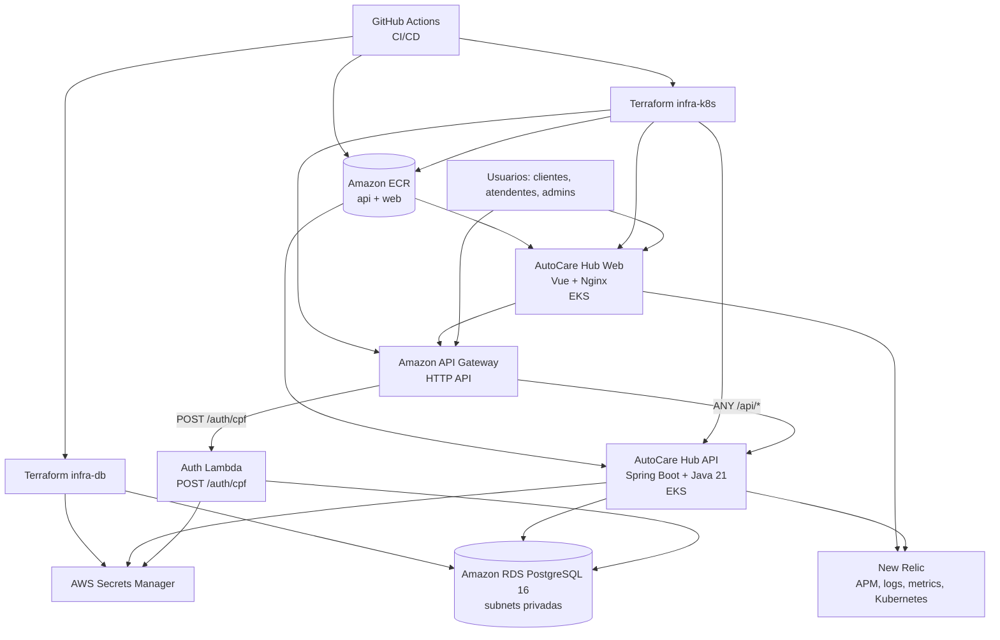

# Arquitetura Cloud - AutoCare Hub Fase 3

## Visao Geral

A Fase 3 evolui o AutoCare Hub de uma execucao local/Kubernetes academica para uma arquitetura cloud na AWS. A solucao separa responsabilidades em cinco repositorios: API, Web, Lambda de autenticacao, infraestrutura do banco e infraestrutura Kubernetes/API Gateway.

O desenho atende aos requisitos de seguranca, escalabilidade, alta disponibilidade e observabilidade com API Gateway, Lambda, RDS PostgreSQL, EKS, HPA, ECR, Terraform e New Relic.

## Diagrama de Componentes Cloud

## Componentes

| Componente | Tecnologia | Responsabilidade |
|---|---|---|
| API Gateway | Amazon API Gateway HTTP API | Entrada publica, roteamento e controle de trafego para Lambda e API no EKS. |
| Auth Lambda | Node.js 22 / AWS Lambda | Validar CPF, consultar cliente ativo no RDS e emitir JWT. |
| Backend API | Java 21 / Spring Boot | Executar regras de negocio de clientes, veiculos, pecas e ordens de servico. |
| Web | Vue 3 / Vite / Nginx | Interface demonstrativa, autenticacao por CPF e consumo das APIs protegidas. |
| Banco | Amazon RDS PostgreSQL 16 | Persistencia relacional gerenciada em subnets privadas. |
| Kubernetes | Amazon EKS | Execucao escalavel dos workloads API e Web. |
| Registry | Amazon ECR | Armazenamento das imagens Docker da API e Web. |
| Observabilidade | New Relic | APM, logs estruturados, metricas de Kubernetes, healthchecks, dashboards e alertas. |
| IaC | Terraform | Provisionamento de RDS, secrets, EKS, ECR, API Gateway e integracoes. |
| CI/CD | GitHub Actions | Testes, validacao Terraform, build/push de imagens e deploy automatico em homolog/producao. |

## Fluxo de Rede

- O cliente acessa o Web ou chama diretamente o API Gateway.
- `POST /auth/cpf` e roteado para a Lambda.
- Rotas `/api/*` sao roteadas para a API Spring Boot em EKS.
- API e Lambda acessam o RDS em subnets privadas.
- Secrets sensiveis ficam no Secrets Manager ou em GitHub Environments, nunca no codigo.
- Logs, metricas e traces sao enviados ao New Relic.

## Disponibilidade e Escala

- RDS executa em subnets privadas e pode operar com Multi-AZ conforme variavel Terraform.
- EKS usa managed node group com tamanho minimo, desejado e maximo configuravel.
- API e Web possuem HPA para escalar replicas por CPU/memoria.
- API Gateway e Lambda sao servicos gerenciados e reduzem a superficie operacional.

## Observabilidade

A observabilidade cobre:

- Latencia de APIs pelo API Gateway, New Relic APM e Actuator.
- CPU/memoria de pods e nodes pelo New Relic Kubernetes integration.
- Healthchecks por `/actuator/health/liveness` e `/actuator/health/readiness`.
- Logs JSON com `correlationId` propagado por `X-Correlation-Id`.
- Metricas customizadas `autocare.service_orders.*` para volume, status e falhas de OS.

## Repositorios

| Repositorio | Papel |
|---|---|
| `SOAT-FIAP-autocare-auth-lambda` | Lambda serverless de autenticacao por CPF. |
| `SOAT-FIAP-autocare-infra-db` | Terraform do RDS PostgreSQL e secrets do banco. |
| `SOAT-FIAP-autocare-infra-k8s` | Terraform de EKS, ECR, API Gateway, New Relic e manifests K8s. |
| `SOAT-FIAP-autocare-api` | Aplicacao principal Spring Boot em Kubernetes. |
| `SOAT-FIAP-autocare-web` | Frontend Vue consumindo API Gateway. |
