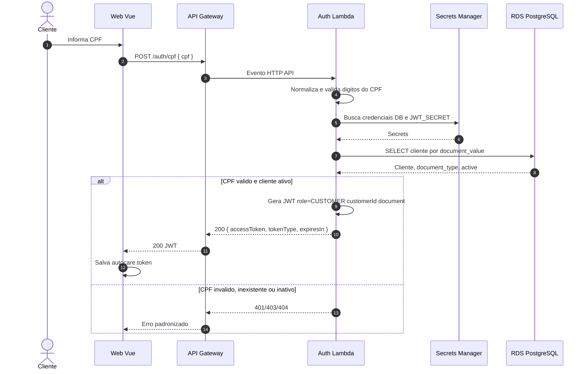
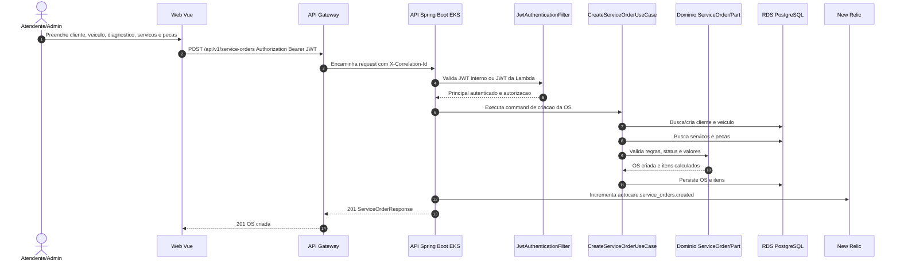

# Sequencias - AutoCare Hub Fase 3

## Autenticacao por CPF

## Abertura de Ordem de Servico

## Correlacao e Logs

Todas as chamadas protegidas carregam `X-Correlation-Id`. Se o header nao chegar na API, o filtro cria um UUID, grava no MDC e devolve o mesmo valor no response. O log JSON emitido para stdout inclui esse `correlationId`, permitindo cruzar eventos do API Gateway, pods e APM no New Relic.
