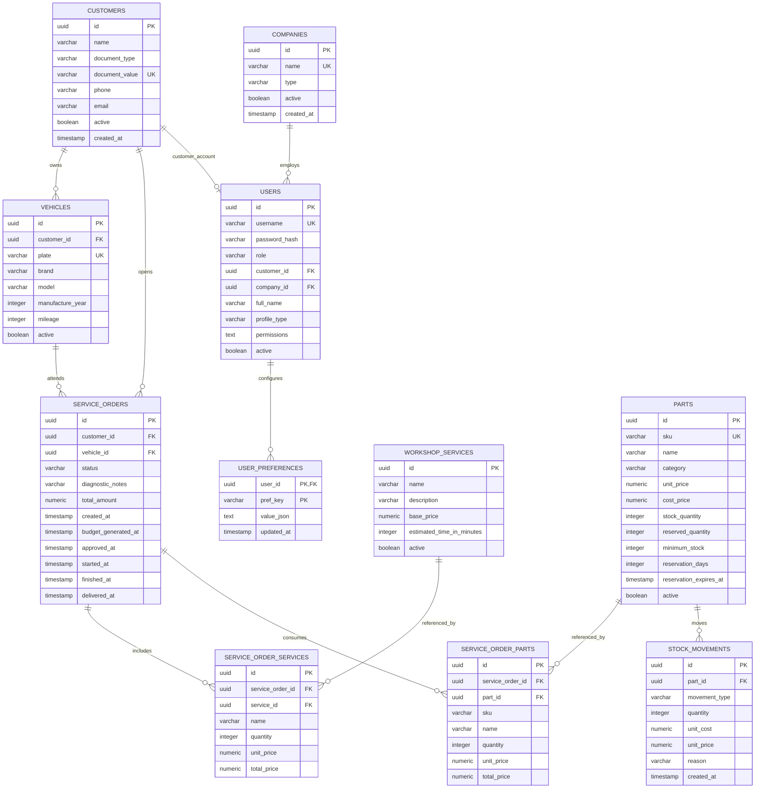

# Modelo Relacional - AutoCare Hub

## Diagrama ER

## Justificativa Formal do Banco

O PostgreSQL foi escolhido porque o dominio da oficina e naturalmente relacional. O fluxo central liga cliente, veiculo, ordem de servico, servicos executados, pecas consumidas, movimentacoes de estoque, usuarios e empresas. Essas relacoes precisam de integridade transacional para evitar OS sem cliente, veiculo sem dono, item de OS sem ordem ou movimentacao de estoque sem peca.

O Amazon RDS foi escolhido para reduzir operacao de banco em producao. Ele oferece backup, armazenamento gerenciado, criptografia, Performance Insights, atualizacoes controladas e possibilidade de Multi-AZ. Isso atende ao objetivo da fase de elevar o projeto para um nivel corporativo sem transferir para a aplicacao responsabilidades de administracao de banco.

## Relacionamentos Principais

| Relacionamento | Cardinalidade | Motivo |
|---|---:|---|
| `customers` -> `vehicles` | 1:N | Um cliente pode possuir varios veiculos; cada veiculo pertence a um cliente. |
| `customers` -> `service_orders` | 1:N | Toda OS precisa de um cliente identificavel. |
| `vehicles` -> `service_orders` | 1:N | Um veiculo pode voltar varias vezes para manutencao. |
| `service_orders` -> `service_order_services` | 1:N | A OS guarda os servicos contratados naquele atendimento. |
| `service_orders` -> `service_order_parts` | 1:N | A OS guarda as pecas usadas/reservadas naquele atendimento. |
| `parts` -> `stock_movements` | 1:N | Cada entrada, saida, ajuste ou baixa precisa ser auditavel. |
| `companies` -> `users` | 1:N | Usuarios administrativos ficam vinculados a oficinas/lojas ou plataforma. |
| `customers` -> `users` | 1:0..1 | Cliente pode ter conta associada, mas na Fase 3 tambem autentica via Lambda por CPF. |

## Constraints de Consistencia

- `document_value` e unico em `customers`, evitando duplicidade de CPF/CNPJ.
- `plate` e unico em `vehicles`, evitando duplicidade de veiculo.
- `sku` e unico em `parts`, permitindo controle confiavel de estoque.
- `status` de OS e limitado por check constraint.
- Valores monetarios e quantidades possuem checks contra valores negativos.
- `reserved_quantity <= stock_quantity` protege reserva maior que estoque.
- Itens de OS usam `ON DELETE CASCADE` para acompanhar a vida da OS.

## Indices

| Indice | Uso |
|---|---|
| `idx_vehicles_customer_id` | Listagem de veiculos por cliente. |
| `idx_service_orders_customer_id` | Consulta de OS por cliente e autorizacao de acesso do cliente. |
| `idx_service_orders_vehicle_id` | Historico de OS por veiculo. |
| `idx_service_orders_status` | Dashboards e filas por status operacional. |
| `idx_service_order_services_order_id` | Carregamento dos servicos de uma OS. |
| `idx_service_order_parts_order_id` | Carregamento das pecas de uma OS. |
| `idx_stock_movements_part_id` | Auditoria e historico de estoque por peca. |
| `idx_stock_movements_type` | Analise de entradas, saidas, reservas e ajustes. |
| `idx_demo_leads_created_at` | Relatorio cronologico de leads de demonstracao. |
| `idx_demo_leads_email` | Busca de leads por contato. |
| `idx_demo_leads_demo_profile` | Segmentacao de leads por perfil. |

## Ajustes Recomendados para Evolucao

- Criar indice composto em `service_orders(status, created_at)` para filas operacionais ordenadas por data.
- Criar indice composto em `service_orders(customer_id, status)` para portal do cliente e consultas protegidas por CPF.
- Criar indice em `customers(document_type, document_value, active)` para acelerar a Lambda de autenticacao CPF.
- Avaliar particionamento de `stock_movements` se o volume historico crescer muito.
- Manter migrations Flyway como unica forma de alterar schema.
