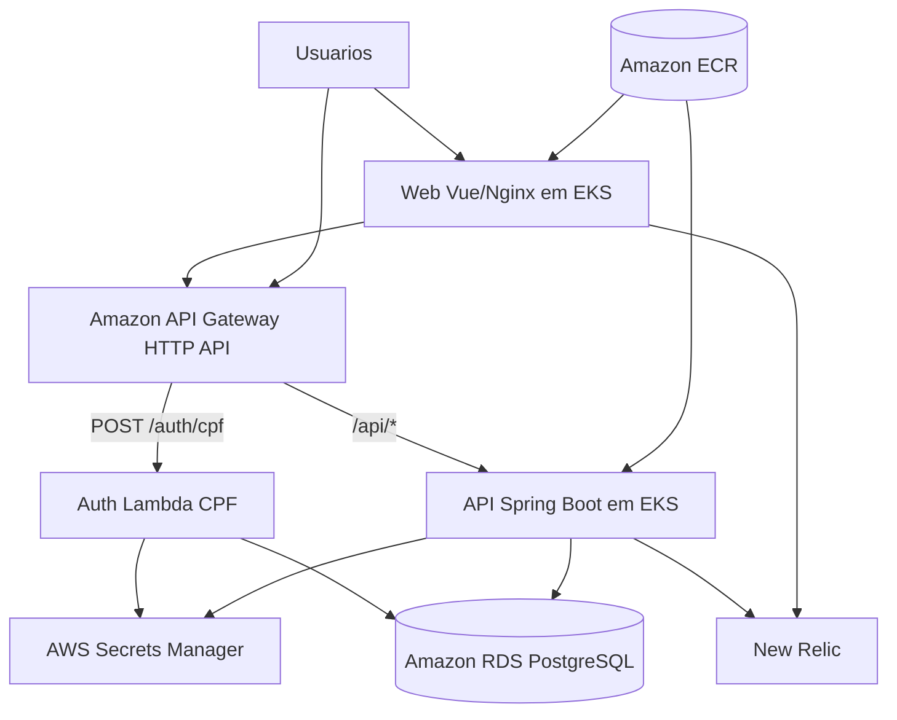

# Documento Final - Tech Challenge Fase 3 - AutoCare Hub

**Projeto:** AutoCare Hub  
**Responsavel:** Yasmin Barcelos Pires  
**Fase:** 3  
**Data:** 01/09/2026

## 1. Repositorios da Entrega

| Repositorio | Branch de trabalho | Papel |
|---|---|---|
| https://github.com/yxsbx/SOAT-FIAP-autocare-auth-lambda | `fase-3` | Function Serverless de autenticacao CPF e emissao JWT. |
| https://github.com/yxsbx/SOAT-FIAP-autocare-infra-db | `fase-3` | Terraform do RDS PostgreSQL e Secrets Manager. |
| https://github.com/yxsbx/SOAT-FIAP-autocare-infra-k8s | `fase-3` | Terraform EKS, ECR, API Gateway, New Relic e manifests K8s. |
| https://github.com/yxsbx/SOAT-FIAP-autocare-api | `fase-3` | API principal Spring Boot executando em Kubernetes. |
| https://github.com/yxsbx/SOAT-FIAP-autocare-web | `fase-3` | Frontend Vue consumindo API Gateway e login CPF. |

## 2. Documentacao

| Documento | Link |
|---|---|
| Diagrama de componentes cloud | https://github.com/yxsbx/SOAT-FIAP-autocare-api/blob/fase-3/docs/architecture/cloud-components.md |
| Diagramas de sequencia | https://github.com/yxsbx/SOAT-FIAP-autocare-api/blob/fase-3/docs/architecture/sequences.md |
| RFC escolha AWS | https://github.com/yxsbx/SOAT-FIAP-autocare-api/blob/fase-3/docs/rfc/RFC-001-aws.md |
| RFC PostgreSQL/RDS | https://github.com/yxsbx/SOAT-FIAP-autocare-api/blob/fase-3/docs/rfc/RFC-002-postgresql-rds.md |
| RFC autenticacao CPF + JWT | https://github.com/yxsbx/SOAT-FIAP-autocare-api/blob/fase-3/docs/rfc/RFC-003-cpf-jwt-auth.md |
| ADR EKS | https://github.com/yxsbx/SOAT-FIAP-autocare-api/blob/fase-3/docs/adr/ADR-001-eks.md |
| ADR HPA | https://github.com/yxsbx/SOAT-FIAP-autocare-api/blob/fase-3/docs/adr/ADR-002-hpa.md |
| ADR New Relic | https://github.com/yxsbx/SOAT-FIAP-autocare-api/blob/fase-3/docs/adr/ADR-003-new-relic.md |
| Diagrama ER e justificativa do banco | https://github.com/yxsbx/SOAT-FIAP-autocare-api/blob/fase-3/docs/database/er-model.md |
| Swagger/OpenAPI | https://github.com/yxsbx/SOAT-FIAP-autocare-api/tree/fase-3/docs/api/openapi |
| Collection Postman | https://github.com/yxsbx/SOAT-FIAP-autocare-api/tree/fase-3/docs/api/postman |

## 3. Arquitetura Cloud

A solucao usa AWS como provedor cloud, com API Gateway como entrada publica, Lambda para autenticacao por CPF, API Spring Boot em EKS, Web em EKS, banco gerenciado PostgreSQL em RDS, imagens em ECR, segredos em Secrets Manager e observabilidade com New Relic.

## 4. Autenticacao por CPF

1. Cliente informa CPF no frontend.
2. Frontend chama `POST /auth/cpf` no API Gateway.
3. API Gateway invoca a Lambda.
4. Lambda valida CPF, consulta `customers` no RDS e verifica `active=true`.
5. Lambda emite JWT com `role=CUSTOMER`, `customerId` e `document`.
6. Web salva o token em `localStorage` e envia `Authorization: Bearer <token>` nas APIs protegidas.
7. API Spring Boot valida o JWT e aplica autorizacao por cliente.

## 5. Abertura de Ordem de Servico

1. Atendente ou usuario autorizado envia dados de cliente, veiculo, diagnostico, servicos e pecas.
2. API Gateway encaminha `/api/v1/service-orders` para a API no EKS.
3. API valida JWT e correlaciona request por `X-Correlation-Id`.
4. Use case cria a OS, valida relacionamentos e aplica regras de dominio.
5. Banco persiste OS, itens de servico, itens de peca e status.
6. Metricas `autocare.service_orders.*` sao emitidas para observabilidade.

## 6. Banco de Dados

O banco escolhido e PostgreSQL 16 em Amazon RDS. A escolha foi feita porque o dominio depende de integridade relacional entre clientes, veiculos, ordens de servico, servicos, pecas, estoque, usuarios e empresas. O RDS entrega backup, criptografia, storage gerenciado, Performance Insights e possibilidade de Multi-AZ.

Principais indices:

- `idx_vehicles_customer_id`
- `idx_service_orders_customer_id`
- `idx_service_orders_vehicle_id`
- `idx_service_orders_status`
- `idx_service_order_services_order_id`
- `idx_service_order_parts_order_id`
- `idx_stock_movements_part_id`
- `idx_stock_movements_type`

## 7. Observabilidade

A stack usa New Relic para:

- Latencia e erros das APIs.
- CPU/memoria de pods e nodes do EKS.
- Healthchecks e uptime.
- Logs JSON com `correlationId`.
- Metricas de ordens de servico.
- Alertas para falhas em processamento de OS.

As configuracoes finais de conta New Relic, dashboards e alertas serao feitas manualmente apos provisionamento dos ambientes.

## 8. CI/CD e Branches

Cada repositorio possui pipeline GitHub Actions. Pull Requests executam validacoes e branches `homolog`/`main` disparam deploy automatico conforme secrets e environments configurados.

A branch `main` deve permanecer protegida, sem commits diretos, exigindo Pull Request a partir de `fase-3` ou branch de homologacao.

## 9. Configuracoes Manuais Pendentes

- Criar/configurar conta AWS, credenciais IAM e GitHub Environments.
- Criar bucket S3 de state e tabela DynamoDB de lock.
- Configurar VPC, subnets privadas/publicas e Security Groups.
- Aplicar Terraform de banco e Kubernetes.
- Preencher Secrets/Variables GitHub de todos os repositorios.
- Configurar New Relic license key, dashboards e alertas.
- Confirmar URL real do API Gateway no Web e README.
- Confirmar acesso do usuario `soat-architecture` em todos os repositorios.
- Gravar e publicar video demonstrativo de ate 15 minutos.

## 10. Video

Link do video: `PENDENTE - inserir link YouTube/Vimeo apos gravacao`.

## 11. Confirmacao de Acesso

Usuario avaliador `soat-architecture`: `PENDENTE - confirmar manualmente em todos os repositorios antes da entrega no portal`.
